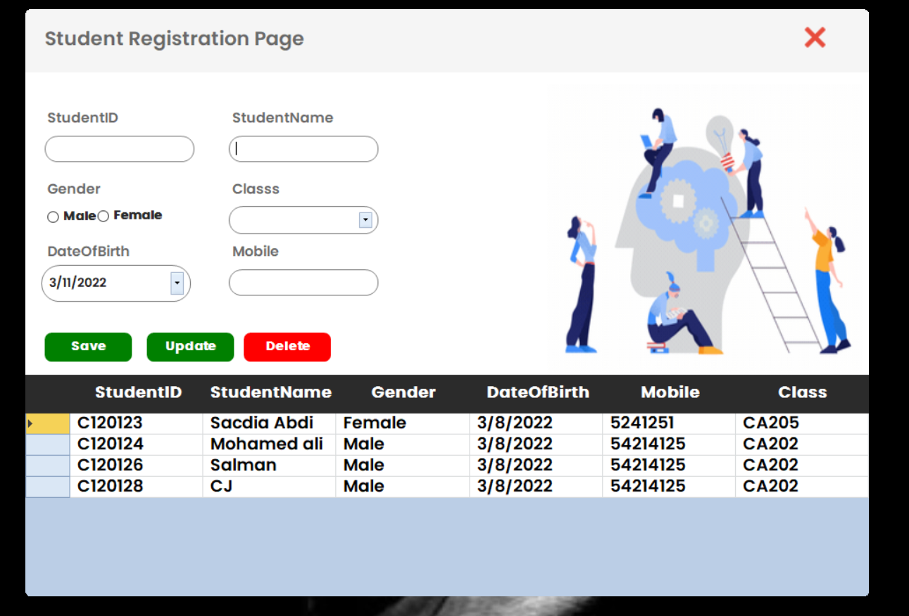

# Student-Registration-With-SQL-Server
Mini Project Crud operation  using Csharp and Sql Server 

# Dependencies
>SQL SERVER SSMS 
>SQL CLIENT (C# Configuration) 
>Server Connections
# Changes
Commits Will Change
# Tip
Locate Connection File And Chnage The Server Connection
To Change Thre Connection Go To The SQL Server Managament
Studio And Copy Your Server Name Then Past (Sql Connection Classs) 
In Connection File.

# Attaching Database
Pickup The Database File And Attach To The Sql Server
Go to The Sql Server And RightClick The Databases  
From The Popup Window Select <kbd>Attach</kbd>.
Then Search The Database File And Attach it.

# FrontForm

# Registration Form

# Contact With me
If There Error Contact With Me 
Agent Email : abdulrahmandev10@gmail.com 
agent Number: 0683533247
